# 深度学习调优指南中文版

*这不是官方认证的 Google 产品。*

**Varun Godbole † , George E. Dahl † , Justin Gilmer † , Christopher J. Shallue ‡ , Zachary Nado †**

† 谷歌研究，谷歌大脑团队

‡ 哈佛大学

## 目录
  - [这份手册是为谁准备的？](#这份手册是为谁准备的)
  - [为什么需要这份调优手册？](#为什么需要这份调优手册)
  - [开始新项目的指南](#开始新项目的指南)
    - [选择模型架构](#选择模型架构)
    - [选择优化器](#选择优化器)
    - [选择BatchSize](#选择Batchsize)
    - [选择初始配置](#选择初始配置)
  - [提高模型性能的科学方法](#提高模型性能的科学方法)
    - [增量调整策略](#增量调整策略)
    - [探索与利用](#探索与利用)
    - [选择下一轮实验的目标](#选择下一轮实验的目标)
    - [设计下一轮实验](#设计下一轮实验)
    - [确定是否采用此训练工作流更改或超参数配置](#确定是否采用此训练工作流更改或超参数配置)
    - [探索结束后](#探索结束后)
  - [确定每次训练运行的步数](#确定每次训练运行的步数)
    - [当训练不受计算限制时如何决定该训练多久](#当训练不受计算限制时如何决定该训练多久)
    - [当训练受计算限制时如何决定该训练多久](#当训练受计算限制时如何决定该训练多久)
  - [关于训练工作流的额外补充](#关于训练工作流的额外补充)
    - [优化输入管道](#优化输入管道)
    - [评估模型性能](#评估模型性能)
    - [保存检查点并追溯选择最佳检查点](#保存检查点并追溯选择最佳检查点)
    - [设置实验跟踪](#设置实验跟踪)
    - [BatchNorm的实现细节](#batchnorm的实现细节)
    - [多主机工作流的注意事项](#多主机工作流的注意事项)
  - [常见问题的回答](#常见问题的回答)
  - [致谢](#致谢)
  - [引用](#引用)
  - [关于贡献](#关于贡献)

## 这份手册是为谁准备的？

**本文档适用于对最大化深度学习的性能**感兴趣的工程师和研究人员（包括个人和团队）。我们假定您具备机器学习和深度学习概念的基本知识。

我们的重点是**超参数调优的过程**，但我们还涉及深度学习学习的其他方面。例如工作流实施和优化，但这些方面并不详尽

我们假设机器学习问题是监督学习或类似的东西（例如自监督学习）。但是，本文档中描述的技术也可能适用于其他类型的问题。

## 为什么需要这份调优手册？

目前，要使深度神经网络在实践中正常运行，需要付出大量的努力和猜测。更糟糕的是，目前很少有人记录下那些深度学习中获得良好结果的实际方法。一方面，通常，论文忽略了导致最终结果的过程，以呈现更清晰的原理。另一方面，处理商业问题的机器学习工程师很少有时间回顾并概括他们的调参过程。教科书也往往回避实用指南，而偏重于基本原理，即使它们的作者具有在应用工作中提供有用建议的经验。在准备创建此文档时，我们找不到任何系统性的资料来解释*如何使用深度学习获得良好的结果*. 相反，我们看到了博客文章和社交媒体上的建议片段、从研究论文附录中收集的技巧、特定项目或工作流的偶然案例研究，以及很多困惑。在深度学习领域，专家和新手用着表面上类似的方法，但所取得的结果之间存在着巨大的差距。与此同时，这些专家也很乐意承认他们所做的一些事情可能没有充分的理由。随着深度学习的成熟并对世界产生更大的影响，社区需要更多涵盖有用方法的资源，包括对于获得良好结果至关重要的所有实用细节。

我们是一个由五名研究人员和工程师组成的团队，多年来一直致力于深度学习。我们已经将深度学习应用到从语音识别到天文学的方方面面，并在此过程中学到了很多东西。本文档源于我们自己训练神经网络、教授学生以及为我们的同事提供实践建议的经验。虽然深度学习已经从少数学术研究实验室中实践的机器学习方法发展成为为数十亿人使用的产品提供动力的技术，但深度学习在工程领域仍处于起步阶段，我们希望本文档能鼓励其他人也来帮助系统化该领域的实验细节。

这份文件是在我们试图实现我们自己的深度学习方法时产生的，因此它只代表作者在撰写本文时的观点，而不是任何客观事实。它被特别强调是因为我们在调整超参数方面遇到了困难，但它也涵盖了我们在工作中遇到（或看到出错）的其他重要问题。我们希望这项工作成为一份活的文件，能随着我们理解的改变从而成长和演变。例如，一份关于如何调试和如何减少训练失败的文档在两年前是不可能写出来的，因为它这得基于最近的结果和正在进行的研究。不可避免地，我们的在此文档中一些建议也将需要更新以考虑新的结果和改进的工作流程。我们不知道最好的深度学习秘诀，但在大众开始记录它并讨论各个步骤之前，我们不能指望找到它。为此，我们鼓励发现我们的建议存在问题的读者提出替代建议以及令人信服的证据，以便我们更新建议。我们也希望看到可能有不同建议的替代指南和方式，以帮助大众追求最佳方法。最后，任何标有🤖表情符号的地方是我们要进一步调查的地方。只有在尝试编写这本 playbook 之后，我们才完全清楚在深度学习从业者的工作流程中可以找到多少有趣及被忽视的研究问题。

## 开始新项目的指南

在调优过程中的许多抉择，我们可以在项目开始时一次性做出决定。只有偶尔在情况发生变化时，才需要重新考虑。

在开始调优之前，请确保您满足以下假设：

- 问题制定、数据清理等基本工作已经完成，花时间在模型架构和训练配置上是有意义的。
- 已经有一个工作流设置用来进行训练和评估，并且可以很容易地为各种感兴趣的模型执行训练和预测工作。
- 已选择并实现适当的评估指标。这些指标应该尽可能地代表在部署环境中测量的内容。

### 选择模型架构

***总结***： *在开始一个新项目时，尽量重用有效的模型。*

- 首先选择一个完善且常用的模型架构来开始工作。这样可以尽早让模型进入工作状态，之后再构建自定义模型也是可行的。
- 模型架构通常具有各种超参数，用于确定模型的大小和其他细节（例如层数、层宽度、激活函数类型）。
  - 因此，选择架构实际上意味着选择一整个系列的各种模型（每个模型都有不同的超参数设置）。
- 如果可以的话，请尝试找到一篇尽可能接近手头问题的相关论文，并将复现该论文中的模型作为起点。

### 选择优化器

***总结***： *从针对手头问题类型的最常用的优化器开始。*

- 没有一个优化器是适用于所有类型的机器学习问题和模型架构的‘最佳’优化器。即使只是 [比较优化器的性能](https://arxiv.org/abs/1910.05446)也是一项艰巨的任务。 🤖

- 我们建议坚持使用成熟、流行的优化器，尤其是在开始新项目时。

  - 理想情况下，选择用于同类问题的最常用优化器。

- 做好关注选择的优化器的 <b>\*所有\*</b> 超参数的准备。

  - 具有更多超参数的优化器可能需要更多的调优工作才能找到最佳配置。

  -   当我们试图找到各种其他超参数（例如架构超参数）的最佳值时，将优化器超参数视为[冗余参数](#identifying-scientific-nuisance-and-fixed-hyperparameters)是有意义的，这在项目的初始阶段尤其重要。
  -   在项目的初始阶段，从更简单的优化器开始会更可取（例如，具有固定动量的 SGD 或具有固定 $\epsilon$、$\beta_{1}$ 和 $\beta_{2}$ 的 Adam ) ，之后可以切换到更通用的优化器。

-   常用且较为完善的优化器包括（但不限于）：
    -   [SGD with momentum](#what-are-the-update-rules-for-all-the-popular-optimization-algorithms)（Nesterov 变体）
    -   [Adam and NAdam](#what-are-the-update-rules-for-all-the-popular-optimization-algorithms)，它们比具有动量的 SGD 更通用。请注意，Adam 有 4 个可调超参数，[他们都很重要](https://arxiv.org/abs/1910.05446)！
        -   参见 [Adam 的超参数应该如何调整？](#Adam 的超参数应该如何调整？)

### 选择BatchSize

***总结***： *Batch Size决定训练速度，并且不应该被直接用于调整验证集性能。通常来说，可用硬件支持的最大Batch Size是较为理想的数值。*

-   Batch Size是决定*训练时间*和*计算资源消耗*的关键因素。
-   增加Batch Size通常会减少训练时间。这非常有益，因为它：
    -   能使固定时间间隔内超参数调整更彻底，最终训练出更好的模型。
    -   减少开发周期的延迟，能更多地测试新想法。
-   资源消耗和Batch Size之间并没有明确的关系，增加Batch Size让资源消耗增加、减少或是保持不变都有可能。
-   Batch Size*不应该*被当作验证集性能的可调超参数。
    -   只要调整好所有超参数（尤其是学习率和正则化超参数）并且训练步数足够，理论上任意的Batch Size都能获得相同的最终性能（参见 [Shallue et al. 2018](https://arxiv.org/abs/1811.03600)） .
    -   详见 [为什么不应该调整Batch Size来直接提高验证集性能？](#为什么不应该调整Batch Size来直接提高验证集性能？)

#### 确定可行的Batch Size并估计训练吞吐量


<details><summary><em>[点击展开]</em></summary>

<br>

-   对于给定的模型和优化器，可用硬件通常能能够支持一系列Batch Size。限制因素通常是加速器（GPU/TPU 等）的内存。
-   不幸的是，如果不运行或者编译完整的训练程序，就很难计算出适合内存的Batch Size。
-   最简单的解决方案通常是以不同的批次大小（例如，用 2 的幂来尝试）运行少量的训练实验，直到其中一个实验超过可用内存。
-   对于每个Batch Size，我们应该训练足够长的时间以准确估计*训练吞吐量*

<p align="center">训练吞吐量 =每秒处理的样本数量</p>

<p align="center">或者，我们可以估计<em>每步时间</em> :</p>

<p align="center">每步时间 =（Batch Size）/（训练吞吐量）</p>

-   当加速器内存未饱和时，如果Batch Size加倍，训练吞吐量也应该加倍（或至少接近加倍）。等效地，随着Batch Size的增加，每步的时间应该是恒定的（或至少接近恒定的）。
-   如果与上述情况不符，那么训练工作流可能存在瓶颈，例如 I/O 或计算节点间的同步。有必要在开始下一步前对此进行诊断和矫正。
-   如果训练吞吐量到某个Batch Size之后就不再增加，那么我们只考虑使用该Batch Size（即使硬件支持更大的Batch Size）
    -   使用更大Batch Size的所有好处都假定训练吞吐量增加。如果没有，请修复瓶颈或使用较小的Batch Size。
    -   使用**梯度积累**技术可以支持的更大的Batch Size。但其不提供任何训练吞吐量优势，故在应用工作中通常应避免使用它。
-   每次更改模型或优化器时，可能都需要重复这些步骤（例如，不同的模型架构可能允许更大的Batch Size）。

</details>

#### 选择合适的Batch Size以最小化训练时间

<details><summary><em>[点击展开]</em></summary>
<br>

<p align="center">训练时间 =（每步时间）x（总步数）</p>

-   对于所有可行的Batch Size，我们通常可以认为每步的时间近似恒定(实际上，增加Batch Size通常会产生一些开销)。
-   Batch Size越大，达到某一性能目标所需的步数通常会减少（前提是在更改Batch Size时重新调整所有相关超参数；[Shallue et al. 2018](https://arxiv.org/abs/1811.03600)）。
    -   例如，将Batch Size翻倍可能会使训练步数减半。这称为**完美缩放**。
    -   完美缩放适用于Batch Size在临界值之前，超过该临界总步数的减少效果将会下降。
    -   最终，增加Batch Size不会再使训练步数减少（永远不会增加）。
-   因此，最小化训练时间的Batch Size通常是最大的Batch Size，也同时减少了所需的训练步数。
    -   Batch Size取决于数据集、模型和优化器，除了通过实验为每个新问题找到它之外，如何计算它是一个悬而未决的问题。🤖
    -   比较Batch Size时，请注意效果(epoch)预算（运行所有实验，固定训练样本的数量达到设定的效果所花的时间）和步数预算（运行设定步数的试验）之间的区别。
        -   将Batch Size与效果预算进行比较只会涉及到完美缩放的范围，即使更大的Batch Size仍可能通过减少所需的训练步数来提供有意义的加速。
    -   通常，可用硬件支持的最大Batch Size将小于临界Batch Size。因此，一个好的经验法则（不运行任何实验）是使用尽可能大的Batch Size。
-   如果最终增加了训练时间，那么使用更大的Batch Size就没有意义了。

</details>

#### 选择合适的Batch Size以最小化资源消耗

<details><summary><em>[点击展开]</em></summary>

<br>

- 有两种类型的资源成本与增加 batch size有关。
  	1. 前期成本，例如购买新硬件或重写训练工作流以实现多GPU/多TPU训练。
  	1. 使用成本，例如，根据团队的资源预算计费，从云供应商处计费，电力/维护成本。

如果增加 batch size有很大的前期成本，那么直到项目成熟且容易权衡成本效益前，推迟其的增加可能更好。实施多机并行训练程序可能会引入[错误](https://link.zhihu.com/?target=https%3A//github.com/google-research/tuning_playbook%23considerations-for-multi-host-pipelines)和[一些棘手的细节](https://link.zhihu.com/?target=https%3A//github.com/google-research/tuning_playbook%23batch-normalization-implementation-details)，所以无论如何，一开始最好是用一个比较简单的工作流。(另一方面，当需要进行大量的调优实验时，训练时间的大幅加速可能会在过程的早期非常有利）。

我们把总的使用成本（可能包括多种不同类型的成本）称为 "资源消耗 "。我们可以将资源消耗分解为以下几个部分。

资源消耗 = (每步的资源消耗) x (总步数)

- 增加 batch size通常可以减少总步骤数。资源消耗是增加还是减少，将取决于每步的消耗如何变化。

- - 增加 batch size可能会减少资源消耗。例如，如果大batch size的每一步都可以在与小batch size相同的硬件上运行（每一步只增加少量时间），那么每一步资源消耗的增加可能被步骤数的减少所抵消。
  - 增加 batch size可能不会改变资源消耗。例如，如果将batch size增加一倍，所需的步骤数减少一半，所使用的GPU数量增加一倍，总消耗量（以GPU小时计）将不会改变。
  - 增加 batch size可能会增加资源消耗。例如，如果增加batch size需要升级硬件，那么每步消耗的增加可能超过训练所需步数的减少。

</details>

#### 更改Batch Size需要重新调整大多数超参数

<details><summary><em>[点击展开]</em></summary>
<br>

-   大多数超参数的最佳值对Batch Size敏感。因此，更改Batch Size通常需要重新开始调整过程。
-   与Batch Size交互最强烈的超参数是优化器超参数（学习率、动量等）和正则化超参数，所以有必要对于针对每个Batch Size单独调整它们。
-   在项目开始时选择Batch Size时请记住，如果您以后需要切换到不同的Batch Size，则为新的Batch Size重新调整所有内容可能会很困难、耗时且成本高昂。

</details>

#### Batch Norm会对Batch Size的选择造成什么影响？

<details><summary><em>[点击展开]</em></summary>
<br>

Batch norm 很复杂，一般来说，应该使用与计算梯度不同的 batch size 来计算统计数据(像[Ghost Batch Norm](https://arxiv.org/abs/1705.08741)采用固定值的batch size)。有关详细讨论，请参阅[BatchNorm的实现细节](#BatchNorm的实现细节)

</details>

#### 选择初始配置

- 在开始超参数调整之前，我们必须确定起点。这包括指定 (1) 模型配置（例如层数），(2) 优化器超参数（例如学习率），以及 (3) 训练步数。
- 确定此初始配置将需要一些手动配置的训练运行和反复试验。
- 我们的指导原则是找到一个简单、相对快速、资源消耗相对较低的配置，以获得“合理”的结果。
  - “简单”意味着尽可能避免花里胡哨的东西；这些总是可以在以后添加。即使花里胡哨的东西在未来被证明是有用的，但在初始配置中添加它们可能会浪费时间调整无用的功能和/或烘烤不必要的并发症。
    - 例如，在添加花哨的衰减方案之前以恒定的学习率开始。
  - 选择快速且消耗最少资源的初始配置将使超参数调整更加高效。
    - 例如，从较小的模型开始。
  - “合理”性能取决于问题，但至少意味着经过训练的模型在验证集上的性能比随机机会好得多（尽管它可能很糟糕，不值得部署）。
- 选择训练步数的数量涉及平衡以下方面：
  - 一方面，训练更多的步数可以提高性能并使超参数调整更容易（参见 [Shallue et al. 2018](https://arxiv.org/abs/1811.03600)）。
  - 另一方面，更少步数的训练意味着每次训练运行得更快并且使用更少的资源，通过减少周期之间的时间并允许并行运行更多实验来提高调整效率。此外，如果一开始选择了一个不必要的大训练步数，那么以后可能很难改变它，例如，已经将学习率针对该步数进行了调整。

## 提高模型性能的科学方法

机器学习开发的最终目标是最大化模型的效用。尽管不同应用场景的开发流程有所不同（例如时间长度、可用计算资源、模型类型等），基本步骤和原则都是相似的。

接下来的指南中我们做出了这些假设：

-   已有能运行且得到不错结果的训练工作流。
-   有足够的计算资源来进行调参实验，至少能够并行发起数个训练流程。

### 增量调整策略

***总结***： *从简单的配置开始，循序渐进，同时进一步了解问题。确保任何改进都有据可循，以避免增加不必要的复杂度。*

-   我们的最终目标是找到一种训练配置来最大化我们模型的性能。
    -   在某些情况下，我们的目标是在固定截止日期（例如提交给竞赛）之前最大限度地改进模型。
    -   在其他情况下，我们希望无限期地改进模型（例如，不断改进生产中使用的模型）。
-   原则上，我们可以使用算法自动搜索整个配置空间来最大化性能，但实践中这往往不实际。
    -   配置空间可能非常大，目前还没有任何算法可以在没有人工指导的情况下有效地搜索这个空间。
-   大多数自动搜索算法依赖于人工设计的*搜索空间*，这些搜索空间往往非常重要。
-   更有效的方法是从简单的配置开始，逐步添加功能并进行改进，同时深化对问题的理解。
    -   我们在每一轮调整中都使用自动搜索算法，并随着我们理解的深度不断更新我们的搜索空间。
-   随着我们的探索，我们自然会找到越来越好的配置，因此我们的“最佳”模型将不断改进。
    -   当我们更新我们的最佳配置时，我们称之为*上线*（这不一定对应线上模型的实际上线）。
    -   对于每次上线，我们必须确保更改是有据可循的——而不仅仅是碰运气找到的配置——以避免给训练工作流增加不必要的复杂性。

综上所述，我们的增量调优策略需要重复以下四个步骤：

1.  为下一轮实验确定适当的目标。
2.  设计并展开实验，朝着这个目标取得进展。
3.  从实验结果中获取经验。
4.  考虑是否上线新的最佳配置。

本节的其余部分将更详细地讲解增量调优策略。

### 探索与利用

***总结***： *大多数时候，我们的目标是更深入地理解问题。*

-   尽管有些人认为我们会花大部分时间来提升验证集的指标，实际上我们把重心放在进一步理解问题上，而不是降低验证集错误率。
    -   也就是说，我们大部分时间都花在了“探索”上，只有一小部分时间花在了“利用”上。
-   从长远来看，如果我们想最大化我们的最终效果，深入理解问题是至关重要的。将深化理解置于短期收益之上可以帮助我们：
    -   避免仅因历史原因而表现良好的不必要更改。
    -   确定验证集效果对哪些超参数最敏感，哪些超参数交互最多，因此需要一起重新调整，以及哪些超参数对其他变化相对不敏感，因此可以在未来的实验中固定住。
    -   发现潜在的新方向，例如在出现过拟合问题时使用新的正则化器。
    -   确定无效的方向并将其删除，从而降低后续实验的复杂度。
    -   判断超参数的优化空间是否已经饱和。
    -   围绕最佳值缩小我们的搜索空间，以提高调整效率。
-   最终，我们可以集中提升验证集效果，即便我们无法从新的实验中进一步了解问题的结构了。

### 选择下一轮实验的目标

***总结***： *每轮实验都应该有一个明确的目标，并且范围要足够小，这样实验才能真正朝着目标取得进展。*

-   每轮实验都应该有一个明确的目标，并且范围要足够小，这样实验才能真正朝着目标取得进展：如果我们试图一次添加多个特征或回答多个问题，我们可能无法理清各自的影响。
-   举个例子，目标可以包括：
    -   尝试对训练流程进行改进（例如，新的正则化器、预处理方法等）。
    -   了解特定模型超参数（例如激活函数）的影响
    -   最大化验证集指标。

### 设计下一轮实验

***总结***： *根据实验目标，将超参数分为三类：目标超参数、冗余超参数和固定超参数。创建一系列研究以比较目标超参数的不同值，同时优化冗余超参数。注意选择冗余超参数的搜索空间，以平衡资源成本与科学价值。*

#### 识别目标超参数、冗余超参数和固定超参数

<details><summary><em>[点击展开]</em></summary>

<br>

-   对于给定的目标，所有超参数都将是**目标超参数**、**冗余超参数**或**固定超参数**。
    -   目标超参数是指，我们希望测量出其对于模型由何种影响的参数。
    -   冗余超参数是指，必须优化才能公平比较不同目标超参数值的参数。类似于统计中的[冗余参数](https://en.wikipedia.org/wiki/Nuisance_parameter)。
    -   固定超参数是指，在当前轮次实验中取固定值的参数。在比较目标超参数的不同值时，固定超参数的值不需要（或者我们不希望它们）改变。
        -   因为实验固定了某些超参数，从实验得出的结论可能对固定超参数的其他值无效。换句话说，固定的超参数对我们的实验结论做了限定。
-   举个例子，如果我们的目标是“确定更深的模型是否会减少验证集错误”，那么模型层数就是目标超参数。
    -   学习率是一个冗余超参数，如果我们要公平对比不同深度的模型，我们必须分别调整学习率（通常情况下最优学习率和模型结构有关）。
    -   激活函数是一个固定超参数。我们可能通过过去的实验发现最优激活函数和模型深度无关。或者我们接受实验得到的最优深度的仅在某个激活函数上有效。或者我们也可以将激活函数作为一个冗余超参数和深度一起调优。
-   一个超参数是目标超参数、冗余超参数还是固定超参数是根据实验目标来决定的。
    -   比如，激活函数的选择可以是一个目标超参数（对于当前问题，ReLU 或 tanh 是更好的选择吗？），一个冗余超参数（允许使用不同的激活函数，最好的 5 层模型是否优于最好的 6 层模型？），或一个固定超参数（对于一个由 ReLU 构成的网络，在特定位置添加批标准化是否有帮助？）。
-   在设计新一轮实验时，我们根据实验目的确定目标超参数。
    -   在此阶段，我们将所有其他超参数视为冗余超参数。
-   接下来，我们将一些冗余超参数转作为固定超参数。
    -   如果有无限的计算资源，我们会将所有非目标超参数保留为冗余超参数，这样我们从实验中得出的结论就不会受到固定超参数的限定。
    -   然而，冗余超参数越多，我们没能充分针对每个目标超参数调优冗余超参数的风险就越高，从而我们从实验中得出错误结论的风险也越高。
        -   如[下文](#平衡实验的信息量和成本)所述，我们可以通过增加计算资源来应对这种风险，但通常我们的最大资源预算低于调整所有非目标超参数所需的计算资源。
    -   当我们判断将一个冗余超参数转换为固定超参数所带来的限制少于调优它所需的计算资源时，我们可以进行这种转换。
        -   一个冗余超参数和目标超参数的相互影响越多，固定这个参数所带来的限制就越多。例如，权重衰减强度的最佳值通常取决于模型大小，因此固定权重衰减的强度来比较不同的模型大小，往往得不出有效的结论。
-   尽管超参数的类型取决于实验目标，但对于某些类别的超参数，我们有以下经验法则：
    -   在各种优化器超参数（例如学习率、动量、学习率调度参数、Adam优化器的beta等）中，至少有一些是冗余超参数，因为它们往往与其他变化相互影响。
        -   它们很少是目标超参数，因为像“训练流程的最佳学习率是多少？”这样的目标没有什么意义——最优学习率很容易随着下一次训练流程的改变而改变。
        -   尽管当资源有限或有强力的证据表明它们不影响目标超参数时，我们可能固定其中一些参数，但通常应该假设优化器超参数必须单独调整，以在不同设置之间进行公平比较目标超参数。
            -   此外，我们没有优化器超参数值的*先验*倾向（例如，它们通常不会以任何方式影响前向传递或梯度的计算成本）。
    -   相比之下，优化器的*选择*通常是一个目标超参数或固定超参数。
        -   如果我们的实验目标涉及在两个或多个不同的优化器之间进行公平比较（例如“确定哪个优化器在给定的步数中产生最低的验证错误”），那么它就是一个目标超参数。
        -   或者，我们可能出于各种原因将其设为固定超参数，包括（1）先前的实验表明最好的优化器和当前的目标超参数无关；（2）当前优化器的训练曲线更容易理解 (3) 当前优化器比其他优化器使用更少的内存。
    -   正则化技术引入的超参数通常是冗余超参数，但是否使用正则化技术往往是目标或固定超参数。
        -   例如，dropout 增加了代码的复杂性，因此在决定是否包含它时，我们会将“no dropout”与“dropout”作为一个目标超参数，而将 dropout 率作为一个冗余超参数。
            -   如果我们决定根据这个实验将 dropout 添加到我们的训练流程中，那么在未来的实验中，dropout 率将是一个冗余超参数。
    -   模型结构超参数通常是目标或固定超参数，因为模型结构变化会影响服务和训练成本、延迟和内存需求。
        -   例如，网络层数通常是一个目标或固定的超参数，因为它往往会对训练速度和内存使用产生巨大影响。
-   在某些情况下，一个超参数是冗余还是固定超参数将取决于目标超参数的值。
    -   例如，假设我们想知道 Nesterov momentum 和 Adam 中哪个优化器的验证错误率更低。目标超参数是 `optimizer`，它的值是 `{"Nesterov_momentum", "Adam"}`。值 `optimizer="Nesterov_momentum"` 引入了冗余/固定超参数 `{learning_rate, momentum}`，但值 `optimizer="Adam"` 引入了冗余/固定超参数 `{learning_rate, beta1, beta2, epsilon}`。
    -   仅针对目标超参数的某些值存在的超参数称为**条件超参数**。
    -   我们不应该仅仅因为两个条件超参数具有相同的名称就认为它们是相同的！在上面的示例中， `learning_rate` 对于 `optimizer="Nesterov_momentum"` 与 `optimizer="Adam"` 是*不同的*条件超参数. 它在两种算法中的作用相似（尽管不完全相同），但在每个优化器中运行良好的值范围通常相差几个数量级。

</details>

#### 创建一组研究

<details><summary><em>[点击展开]</em></summary>

<br>

-   确定了目标和冗余超参数之后，我们会设计一个“研究”或一系列研究，以朝着实验目标取得进展。
    -   一项研究指定了一组要运行的超参数配置以供后续分析。每个配置称为“试验”。
    -   创建研究通常涉及几个方面：选择试验所需的超参数变量，选择这些超参数的取值范围（“搜索空间”），选择试验次数，以及选择自动搜索算法。或者，我们可以通过手动指定一组超参数配置来创建研究。
-   研究的目的是使用目标超参数的不同值运行训练流程，同时 **“优化掉”**（或“优化”）冗余超参数，以便公平的比较不同的目标超参数值。
-   在最简单的情况下，我们将对目标超参数的每个配置进行单独研究，其中每个研究都会调整冗余超参数。
    -   例如，如果我们的目标是从 Nesterov、momentum 和 Adam 中选择最佳优化器，我们可以创建一个研究，并设置 `optimizer="Nesterov_momentum"` 和冗余超参数为 `{learning_rate, momentum}`。然后创建另一项研究，并设置 `optimizer="Adam"` 和冗余超参数为 `{learning_rate, beta1, beta2, epsilon}`。最后通过比较两个研究中的最优试验来比较这两个优化器。
    -   我们可以使用任何无梯度优化算法，包括贝叶斯优化或进化算法等方法，来优化冗余超参数。但是，在[探索阶段](#探索与利用)，[我们更偏向](#为什么在优化的探索阶段使用Quasi-Random-Search而不是更复杂的黑盒优化算法？)使用准随机算法，因为这些方法在探索阶段有多种优势。在[探索结束后](#探索结束后)，我们会优先选择最先进的贝叶斯优化方法。
-   在更复杂的情况下，我们想要比较大量目标超参数的值，并且我们无法进行大量相对独立的研究，我们可以将目标超参数与冗余超参数放在相同的搜索空间中，并使用搜索算法在单个研究中对*两种超参数*的值进行采样。
    -   采用这种方法时，条件超参数可能会是一个问题，因为很难指定对应的搜索空间，除非所有目标超参数值都有相同的冗余超参数集。
    -   在这种情况下，[我们更加偏好](#为什么在优化的探索阶段使用Quasi-Random-Search而不是更复杂的黑盒优化算法？)使用Quasi-Random-Search算法，因为它确保我们能相对均匀的采样目标超参数值。无论搜索算法如何，我们都需要确保它均匀搜索目标超参数。

</details>

#### 平衡实验的信息量和成本

<details><summary><em>[点击展开]</em></summary>

<br>

-   在设计一项研究或一系列研究时，我们需要分配有限的预算，以充分满足以下三个要求：
    1.  比较足够多目标超参数的不同值。
    2.  在足够大的搜索空间上调整冗余超参数。
    3.  对冗余超参数的搜索空间进行足够密集的采样。
-   这三个必要条件，确保我们能从实验中获得足够多的经验。
    -   尽可能多地比较目标超参数的值可以拓宽我们从实验中获得的经验的范围。
    -   包括尽可能多的有冗余超参数，并允许每个冗余超参数有尽可能大的值域。这样我们更有信心相信，对于一个目标超参数配置，在当前搜索空间中，**存在**“好的”冗余参数。
        -   否则，我们可能因为没有搜索某些冗余超参数空间，而对不同目标超参数值进行了不公平的比较。
    -   尽可能密集地对冗余超参数采样，也能让我们更加有信心相信搜索流程能够找到好的冗余超参数配置。
        -   否则，我们可能对不同目标超参数值进行了不公平的比较。因为某些值恰好有更好的冗余超参数配置。
-   不幸的是，对这三个要求的*任何*一个进行改进都需要增加试验次数，从而增加资源成本。或者，我们只能从其他要求中想办法节约资源。
    -   每个问题都有自己的特性和计算资源限制，因此如何在这三个需求之间分配资源需要一定程度的领域专业知识。
    -   在进行一项研究后，我们都会总结该研究是否将冗余超参数调整得足够好（即充分搜索了足够大的空间）以公平地比较目标超参数（更详细的描述[如下](#从实验结果中获取经验)）。

</details>

### 从实验结果中获取经验

***总结***： *除了尝试实现每组实验的原始科学目标之外，还要检查其他问题的清单，如果发现问题，请修改实验并重新运行。*

-   最终，每组实验都有一个特定的目标，我们想要评估实验为该目标提供的证据。
    -   然而，如果我们提出正确的问题，我们通常会发现在一组给定的实验能够朝着最初的目标取得很大进展之前需要纠正的问题。
        -   如果我们不问这些问题，我们可能会得出不正确的结论。
    -   由于运行实验的成本很高，我们还希望借此机会从每组实验中提取其他有用的见解，即使这些见解与当前目标并不直接相关。
-   在分析一组给定的实验以朝着最初的目标取得进展之前，我们应该问自己以下额外的问题：
    -   [搜索空间够大吗？](#identifying-bad-search-space-boundaries)
        -   如果研究的最佳点在一维或多维搜索空间的边界附近，则搜索可能不够广泛。在这种情况下，我们应该进行另一项具有扩展搜索空间的研究。
    -   [我们是否从搜索空间中采样了足够多的点？](#not-sampling-enough-points-in-the-search-space)
        -   如果不是，则在调整目标中运行更多点或不那么雄心勃勃。
    -   每项研究中有多少试验是**不可行**（即出现分歧的试验、得到非常糟糕的损失值，或者因为违反某些隐式约束而根本无法运行）？
        -   当研究中很大一部分点是**不可行**时，我们应该尝试调整搜索空间以避免对这些点进行采样，这有时需要重新参数化搜索空间。
        -   在某些情况下，大量不可行点可能表示训练代码中存在错误。
    -   [模型是否存在优化问题？](#how-can-optimization-failures-be-debugged-and-mitigated)
    -   [我们可以从最佳试验的训练曲线中学到什么？](#examining-the-training-curves)
        -   例如，最好的试验是否具有与有问题的过度拟合一致的训练曲线？
-   如有必要，根据上述问题的答案，改进最近的研究（或研究组）以改进搜索空间和/或抽样更多试验，或采取其他一些纠正措施。
-   一旦我们回答了上述问题，我们就可以继续评估实验为我们最初的目标提供的证据（例如，[评估改变是否有用](#detecting-whether-a-change-is-useful-with-isolation-plots)）。


#### 识别错误的搜索空间边界

<details><summary><em>[点击展开]</em></summary>

<br>

-   如果从搜索空间中采样的最佳点靠近其边界，那么这个搜索空间就有可疑之处。如果我们将搜索范围朝着这个方向扩大，我们可能会找到更优秀的点。
-   为了检查搜索空间边界，我们喜欢在被我们称之为**基本超参数轴图**的图表绘制已完成的试验，我们在其中绘制验证目标值与其中一个超参数（例如学习率）的关系。图中的每个点都对应于一次试验。
    -   每次试验的验证目标值通常应该是它在训练期间达到的最佳值。

<p align="center" id="figure-1">
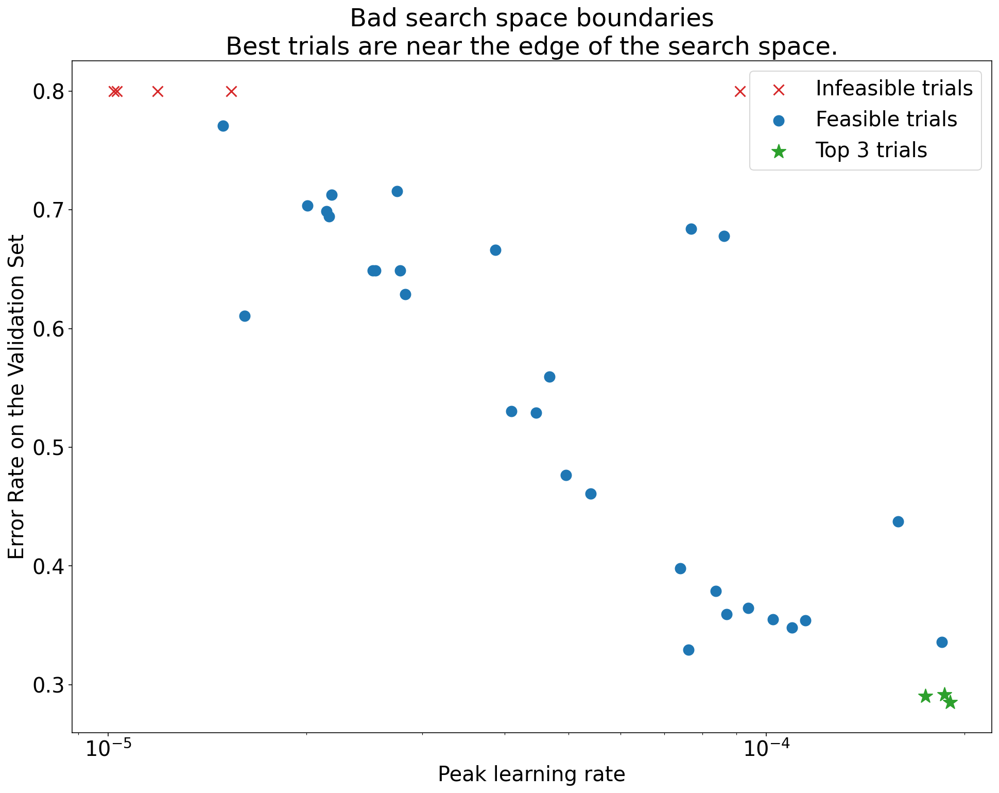
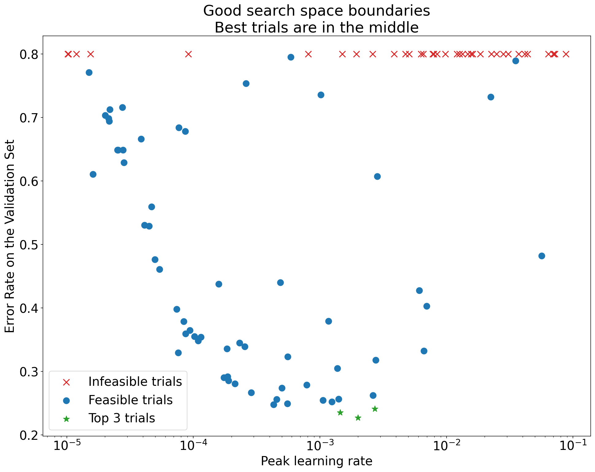
</p>


<p align="center"><b>图 1：</b>不良的搜索空间边界和可接受的搜索空间边界示例。</p>

-   [Figure 1](#figure-1)中的图表显示错误率（越低越好）与初始学习率的关系。
-   如果最佳点聚集在搜索空间的边缘（在某个维度上），则可能需要扩展搜索空间边界，直到最佳观察点不再靠近边界。
-   通常，一项研究将包括“不可行”的试验，这些试验会产生分歧或得到非常糟糕的结果（在上图中用红色 X 标记）。
    -   如果所有试验对于大于某个阈值的学习率都是不可行的，并且如果表现最好的试验在该区域的边缘具有学习率，则模型[可能遇到了稳定性问题，从而无法获得更高的学习率](#how-can-optimization-failures-be-debugged-and-mitigated)。

</details>

#### 没有在搜索空间中采样足够的点

<details><summary><em>[点击展开]</em></summary>

<br>

-   一般来说，[可能很难知道](#how-many-trials-are-needed-to-get-good-results-with-quasi-random-search)是否搜索空间已经被足够密集地采样。🤖
-   运行更多的试验当然更好，但代价是显而易见的。
-   由于很难知道我们什么时候采样足够，我们通常会采样我们可以负担得起的代价，并尝试通过反复查看各种超参数轴图来校准我们的直觉，并试图了解有多少点位于搜索空间的“好”区域。

</details>

#### 检查训练曲线

<details><summary><em>[点击展开]</em></summary>

<br>

***总结***： *检查训练曲线是识别常见故障的一种简单方法，也可以帮助我们优先考虑下一步采取什么行动。*

-   虽然在许多情况下，我们实验的主要目标只需要考虑每次试验的验证误差，但在试验中将验证误差减少到固定数字时我们必须小心，因为它可以隐藏表面下发生的事情的重要细节。
-   对于每一项研究，我们总是查看至少是最好的几项试验的**训练曲线**（绘制的训练误差和验证误差与训练期间训练步数的关系图）。
-   即使这对于解决主要的实验目标不是必要的，但检查训练曲线是识别常见故障模式的简单方法，也可以帮助我们优先考虑下一步采取什么行动。
-   在检查训练曲线时，我们对以下问题感兴趣。
-   是否有任何试验显示**过拟合**？
    -   当验证误差在训练期间的某个时刻开始*增加*时，就会发生过度拟合。
    -   在试验中(我们对目标超参数的不同设置选取最佳试验效果的试验[这实际上优化了冗余超参数])，我们应该*至少*在目标超参数的每个设置相对应的最佳试验中检查是否有过拟合问题。
        -   如果任何最佳试验出现过拟合问题，我们通常会在比较目标超参数的不同值之前使用额外的正则化技术重新运行实验和/或更好地调整现有的正则化参数(防止因固定超参数的设置漏掉可能的优解？)。
            -   如果目标超参数包括正则化参数，这可能不适用，因为如果这些正则化参数的低强度设置导致有问题的过拟合是不足为奇的。
        -   使用常见的正则化技术减少过度拟合通常很简单，这些技术增加了代码复杂性的下届或额外的计算（例如，dropout、标签平滑化、权重衰减），因此在下一轮实验中添加一个或多个这些通常问题不大。
        -   举个例子，如果目标超参数是“隐藏层数”，当使用最大隐藏层数的最佳试验表现出过拟合问题，那么我们通常更愿意使用额外的正则化再次尝试，而不是立即选择较小数量的隐藏层。
        -   即使“最佳”试验都没有表现出有过拟合，但它发生在*所有*试验中时，这就可能存在问题。
            -   选择最佳试验会抑制出现过拟合问题的配置，并偏向那些不会出现过拟合问题的配置。换句话说，它对具有更多正则化的配置更偏爱。
            -   然而，任何让训练变得更糟的事情都可以作为正则化器，即使它不是故意的。例如，选择较小的学习率可以通过阻碍优化过程来规范训练，但我们通常不希望以这种方式选择学习率。
            -   因此，我们必须意识到，目标超参数的每个设置的“最佳”试验是否会以有利于某些目标或冗余超参数像“坏”值的方式选择。
-   在训练后期，训练或验证误差是否存在较高的步与步之间的[方差](https://math.stackexchange.com/questions/3604607/can-i-work-out-the-variance-in-batches)？
    -   如果是这样，这可能会干扰我们比较目标超参数的不同值的能力（因为每个试验都随机地在 "幸运 "或 "不幸运 "的一步上结束），以及我们在生产中重现最佳试验结果的能力（因为生产模型可能不会像研究中那样在 "幸运 "一步上结束）。
    -   导致步间方差的最大可能的是Batch的方差（应当从训练集中随机抽取样本），过小的验证集，以及在训练后期使用过高的学习率。 
    -   可能的补救措施包括增加Batch Size，使用更多的验证数据，使用学习率衰减，或使用Polyak平均法。
-   训练结束时试验是否仍能改进？
    -   如果是这样，这表明我们在[“计算限制”](#determining-the-number-of-steps-for-each-training-run)制度中，我们可能会受益于[增加训练步数](#Deciding-how-long-to-train-when-training-is-compute-bound)或更改学习率计划。
-   训练集和验证集的性能在最后的训练步骤之前很久就饱和了吗？
    -   如果是这样，这表明我们处于[“不受计算限制”](#determining-the-number-of-steps-for-each-training-run)制度中，我们可能能够[减少训练步数](#deciding-how-long-to-train-when-training-is-not-compute-bound)。
-   虽然我们不能一一列举，但还有许多其他的行为可以通过检查训练曲线而变得明显（例如，训练误差在训练过程中增加，通常表明训练工作流中存在错误）。

</details>

#### 使用isolation图检测更改是否有用


<details><summary><em>[点击展开]</em></summary>

<br>


<p align="center" id="figure-2">
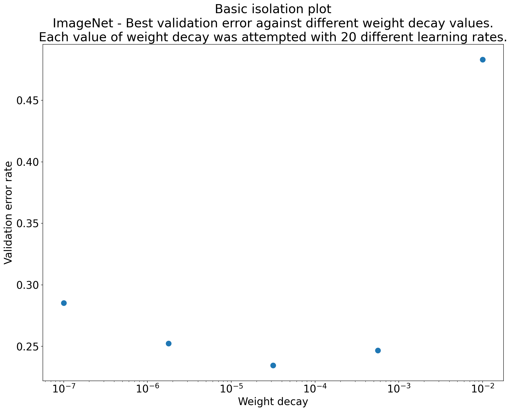
</p>


<p align="center"><b>图 2：</b>研究在 ImageNet 上训练的 ResNet-50 的最佳权重衰减值的isolation图。</p>

-   通常，一组实验的目标是比较目标超参数的不同值。
    -   例如，我们可能想要确定导致最佳验证误差的权重衰减值。
-   **isolation图**是基本超参数轴图的特例。isolation图上的每个点对应着在优化某些（或全部）冗余超参数上最佳试验的性能。
    -   换句话说，我们绘制了在"优化掉"冗余超参数后模型的性能。
-   isolation图可以更轻松地在目标超参数的不同值之间进行同类比较。
-   例如，[图2](#图2)显示了在ImageNet上训练的ResNet-50的特定配置(学习率)下产生最佳验证性能的权重衰减值。
    -   如果我们的目标是确定是否要加入权重衰减，那么我们会将此图中的最佳点与没有权重衰减的Baseline进行比较。为了公平比较，Baseline的学习率也应该同样得到很好的调整。
-   当我们正在考虑为一个连续的超参数来绘制isolation图时，并且我们是使用Quasi-Random-Search(近似随机搜索)产生的超参数的不同值时，我们可以通过对基本超参数轴图的X轴值进行分桶，并在分桶定义的每个垂直切片中取最佳试验来近似绘制隔离图。

</details>

#### 自动化常用的绘图

<details><summary><em>[点击展开]</em></summary>

<br>

-   当第一次生成此类图表花费的努力越多，您查看这类图表的频率就越低。因此，最好将您的基础策略设为自动生成尽可能多的图表。
-   至少，我们会为我们在实验中变化的所有超参数自动生成基本超参数轴图。
-   此外，我们会自动为所有试验生成训练曲线，并尽可能轻松地找到每项研究中最好的几次试验并检查它们的训练曲线。
-   我们可以也添加许多其他有用的潜在图表和可视化。尽管上面的例子的是一个很好的起点，但套用杰弗里 · 辛顿 (Geoffrey Hinton) 的话，“每次设计新事物时，您都会学到新事物。”

</details>

### 确定是否采用此训练工作流更改或超参数配置

***总结***： *当决定是否对我们的模型或训练程序进行改变或采用新的超参数配置时，我们需要理解导致我们结果中不同的变化的来源。*

-   当我们试图改进我们的模型时，我们可能会观察到，与我们现有的配置相比，一个特定的候选变化最初取得了更好的验证误差，但在重复实验后发现，没有发现一致的优势。非正式地，我们可以把可能导致这种不一致结果的最重要的变化来源分为以下几大类。
    -   **训练程序方差**、**再训练方差**或**试验方差**：我们在使用相同的超参数但不同的随机种子的训练运行之间看到的差异。
        - 例如，不同的随机初始化、训练数据的shuffles、dropout掩码、数据增强操作的模式和并行运算的顺序，都是试验方差的潜在来源。
    -   **超参数搜索方差**或**学习方差**：由我们选择超参数的程序引起的结果变化。
        -   例如，我们可能会在特定搜索空间运行相同的实验，但使用两个不同的种子进行Quasi-Random-Search搜索，并最终选择不同的超参数值。
    -   **数据收集和抽样方差**：训练数据、验证数据和测试数据的任何一种随机分割所产生的方差，或者更普遍的由于训练数据生成过程而产生的方差。
-   使用严格的统计测试对有限验证集上估计的验证错误率进行比较是很好的，但往往仅试验方差就能在使用相同超参数设置的两个不同的训练模型之间产生统计上的显著差异。
-   当我们试图得出超出超参数空间中单个点水平的结论时，我们最关心的是学习方差。
    -   学习方差取决于试验次数和搜索空间，我们已经看到它大于试验方差的情况以及它小得多的情况。
-   因此，在采用一个候选变化之前，考虑运行最佳试验N次，以估计训练方差。
    -   通常情况下，我们可以只在工作流发生重大变化后重新对试验方差进行估计，但在某些应用中，我们可能需要使用更新鲜的估计。 
    -   在其他应用中，估计试验方差的成本太高，不值得这样做。
-   归根结底，虽然我们只想采用能够产生真正改进的更改（包括新的超参数配置），但要求完全相信某些东西会有所帮助也不是正确的要求。
-   因此，如果一个新的超参数点（或其他变化）得到比Baseline更好的结果（尽可能考虑新点和Baseline的再训练方差），那么我们可能应该采用它作为新的Baseline为以后的比较。
    -   但是，我们应该只采用产生的改进超过它们增加的复杂性的更改。


### 探索结束后

***总结***： *一旦我们完成了对“好”的搜索空间的探索，并决定了哪些超参数甚至应该被调整，贝叶斯优化工具就是一个值得考虑的选择。*

-   在这个时候，我们的优先事项将从学习更多优化经验转向产生一个最佳配置来启动或以其他方式使用。
-   在这一点上，我们应该有一个精确的搜索空间，可以舒适地包含最佳观察试验周围的局部区域，并且已经过充分采样。
-   我们的探索工作应该已经揭示了最重要的要调整的超参数（以及它们的合理范围），我们可以使用这些超参数来构建搜索空间，以使用尽可能大的调整预算进行最终的自动调整研究。
-   由于我们不再关心最大化我们对优化问题的经验，[Quasi-Random-Search的优化方式](#why-use-quasi-random-search-instead-of-more-sophisticated-black-box-optimization-algorithms-during-the-exploration-phase-of-tuning)不再适用，这时应该使用贝叶斯优化工具来自动找到最佳超参数配置。
    -   如果搜索空间包含大量发散点（获得 NaN 训练损失或比平均值差很多标准差的训练误差的点），使用黑盒优化工具来正确处理发散试验很重要（请参阅[具有未知约束的贝叶斯优化](https://arxiv.org/abs/1403.5607)是处理此问题的绝佳方法）。
-   此时，我们还应该考虑检查测试集上的性能。
    -   原则上，我们甚至可以将验证集折叠到训练集中，并重新训练通过贝叶斯优化找到的最佳配置。但是，这只适用于未来不会有这种特定工作需求的情况（例如，单次 Kaggle 竞赛）。

## 确定每次训练运行的步数

-   有两种类型的工作模式：受计算限制的和不受计算限制的。
-   当训练为**受计算限制**时，训练受限于我们愿意等待的时间，而不是受我们拥有多少训练数据或其他因素的限制。
    -   在这种情况下，如果我们能以某种方式延长训练时间或提高训练效率，我们应该看到较低的训练损失，并且通过适当的调整，改善验证损失。
    -   换句话说，加快训练速度就等于改善训练效果，而 "最佳 "训练时间总是 "我们愿意等待的时间"范围内。
    -   然而，当工作模式受计算限制时，并不意味我们只能通过更长/更快的训练来改善结果。
-   当训练为**不受计算限制**时，我们可以负担得起训练的时间，只要我们愿意。或在某些时候，训练更长的时间并没有多大帮助（甚至会导致过拟合）。
    -   在这种情况下，我们应该期望能够训练到非常低的训练误差，训练时间更长可能会略微减少训练误差，但不会显着减少验证误差。
    -   当训练不受计算限制时，慷慨的训练时间预算可以使调整更容易，特别是在调整学习率衰减计划时，因为它们与训练预算有特别强的相互作用。
        -   换句话说，吝啬的训练时间预算可能需要将学习率衰减计划调整到完美，以实现良好的训练效果。
-   不管一个给定的工作负载是否是计算约束，使用增加梯度方差（跨Batch）的方法通常会导致较慢的训练进度，从而可能增加达到特定验证损失所需的训练步骤。高梯度方差可能是由以下原因造成的。
    -   使用了较小的Batch Size
    -   使用了数据增强技术
    -   添加了一些类型的正则化（例如 dropout）

### 当训练不受计算限制时如何决定该训练多久

-   我们的主要目标是确保我们训练的时间足够长，以使模型达到最佳效果，同时避免在训练步数的数量上过度浪费。
-   在有疑问的时候，请偏向于选择延长训练时间。假设回顾性（最佳）检查点选择使用得当，并且检查点足够频繁，那么训练时间越长，性能就越不会下降。
-   不要在训练中调整 `max_train_steps` 以获得更好的效果。我们只需要选择一个值并将其用于所有试验。从这些试验中，绘制回顾检查点选择发现的训练steps，以优化`max_train_steps`的数值。
    -   例如，如果最佳step总是出现在训练过程的前10%，那么最大训练step数就太高了。
    -   或者，如果最好的step总是出现在训练过程的最后的25%中，我们可能可以在增加训练时间和重新调整学习率衰减策略中受益(都与max_train_steps相关)。
-   当模型架构或数据发生变化时(例如添加数据增强)，理想的训练的step数也会发生变化。
-   下面我们将描述如何根据使用恒定学习率“完全拟合”训练集所需的step数，为`max_train_steps`选择初始候选值。
    -   注意，我们并没有以精确或数学定义良好的方式使用短语“完美拟合训练集”。
        它只是一个非正式的描述语，表示非常低的训练损失。
        -   例如，当训练损失为log loss且没有正则化项时，我们可能会看到训练损失会一直在缓慢减小(这与log loss的特性有关)，直到达到浮点极限（floating point limits），因为网络权重可以无限制地增长，模型会对训练集的预测变得越来越自信。在这种情况下，我们可能会说，当训练集中的错误分类为0时，模型“完全拟合”训练集。
    -   如果训练过程中 gradient noise(译注：可参考Umut Simsekl et al) 增大时，则`max_train_steps`可能需要增加起始值。
        -   例如，如果在模型中引入数据增强或dropout等正则化方法。
    -   如果训练过程以某种方式改进，可能会减少`max_train_steps`。
        -   例如，使用更好的优化器或更好的学习率更新策略。

#### 使用学习率搜索算法来确定 max_train_steps 的初始值

<details><summary><em>[点击展开]</em></summary>

<br>

-   此过程假设不仅可以“完美”地拟合训练集，而且可以使用恒定的学习率更新策略来实现。
-   如果可以完美地拟合整个训练集，那么`max_train_steps`应该有一个确定的值可以完美地拟合训练集；找到这个值作为`max_train_stepsd`的起点`N`
-   在没有数据增强和正则化的情况下运行恒定的学习率搜索（即网格搜索学习率），其中每个试验训练 `N` 步骤。
-   在搜索中最快达到完美训练的实验所需的步数就是我们对 `max_train_steps` 的初步猜测。
-   **注意：** 错误的搜索空间可能会导致自欺欺人。
    -   例如，如果一项研究中的所有学习率都太小，我们可能会错误地得出结论，认为一个非常大的`max_train_steps`的值是必要的。
    -   至少，我们应该检查研究中的最佳学习率是否在搜索空间的边界(基本超参数轴图)。

</details>

### 当训练受计算限制时如何决定该训练多久

-   在某些情况下，训练误差会无限地改善，而我们的耐心和计算资源就成为了限制因素。
-   如果训练误差（或甚至验证误差）可以无限地改善，我们是否应该在我们能接受的情况下一直训练？答案是不必要。
    -   通过运行更多的短时间的实验，我们可以更快地找到最佳的模型和优化器超参数，而不必浪费大量的计算资源和时间在不优秀的超参数上。最后，我们可能会运行少量的长时间("production length" 指模型在生产环境中运行的时间,也就是预期的长时间训练)的实验来在最佳超参数点上获得最终模型。这样，我们就可以更有效地使用我们的资源来调整最有可能在生产环境中表现良好的模型。
    -   我们的训练时间越长，我们对模型的理解就会越深入，这样我们就可以更好的了解模型的性能和限制，因此我们可以更确定哪些参数是最有可能在生产环境中表现良好的参数。但是，当我们的训练时间越长，我们能完成的实验就会越少，因为我们的耐心和计算资源有限。
    -   当我们只训练 ~10% 的production length时，我们可能能够回答很多问题，但是在这个时间限制下的结论不一定适用于20%的production length的实验，更不用说100%了。这是因为训练模型的时间越长，模型就会越来越接近其最佳性能，而在较短的训练时间内得出的结论可能不能完全适用于长时间训练后的模型。
-   因此我们建议在每轮调整中逐渐增加训练步数限制，以在有限的资源和耐心内获得最大的理解，并在最终长时间训练后再进行验证和确认。
    -   我们可以想做多少轮就做多少轮，但通常 1-3 轮是最实用的。
    -   从本质上讲，在进行调整时要在两个方面进行平衡：相关性和彻底性。相关性指的是调整结果与最终长时间运行之间的相似性，而彻底性则指调整结果的详尽程度。因此，在进行调整时，我们应该尽量使用快速转换时间的试验来获得尽可能多的问题理解，同时保证这些结论与最终长时间运行相关。这样可以在有限的时间和资源内获得最大的理解，并尽可能地减少对最终长时间运行的影响。
    -   一旦给定的每次试验时间限制中产生了有用的见解，我们就可以增加训练时间并继续调整，以确保它们在长时间运行中仍然适用。
-   作为起点，我们建议进行两轮调整：
    -   第一轮：进行短时间的训练来找到较佳的模型和优化器超参数
    -   第二轮：在较佳的超参数上进行少量长时间的训练来得到最终模型
-   从 `Round i` → `Round i+1` 的最大问题是如何调整学习率衰减计划。
    -   在进行调整时，最大的问题是如何调整学习率衰减计划。在调整学习率衰减计划时的一个常见问题是使用了太小的学习率，如果学习率过小，模型的收敛速度会变慢，可能会需要更多的训练步骤才能达到最优状态。这可能会增加训练时间并增加计算资源的需求。

#### 第一轮

<details><summary><em>[点击展开]</em></summary>

<br>

-   遗憾的是，在短时间和不完整训练中找到的超参数在增加训练长度后仍然是好选择的保证是没有的。但是，对于某些类型的超参数，它们通常具有足够的相关性，因此第一轮非常有用。
-   我们期望在短运行中找到的哪些超参数值会转移到更长的训练运行中？对于这一切，我们需要更多的研究。但是根据已有的结论我们可以提出一些猜测，以下是作者的猜测，按转移概率的降序排列：
    -   极有可能转移
        -   在第一轮调参中，使用较少的训练步数可以解决早期训练的不稳定性。也许这些超参数是最能保证转移的选择。
            -   Warmup时长
            -   模型参数初始值
    -   可能转移
        -   模型架构 - 模型架构上的显著胜利通常会转移，但可能有很多例外。
    -   可能会转移
        -   优化算法/优化器超参数——我们认为这将"松散"转移。它明显比上面的东西弱。
        -   数据增强方法
        -   正则化
            -   如果不可能完美地拟合训练集，则模型可能处于正则化不太可能有太大的帮助。
    -   不太可能转移
        -   学习率衰减计划：不太可能完美迁移。
            -   [This paper](https://arxiv.org/abs/2203.15556)说学习率衰减计划也能转移。但我们不相信这在通常情况下是正确的。例如：在较少的训练步骤上调整开根号衰减，然后扩展到大量训练步骤将导致在过小的步骤上进行大部分训练。
                -   在极端训练预算限制下，可能可以用大多数计划做到“足够好”，但如果进行了调整，可能会看到明显的性能改进。
            -   [了解随机元优化中的短期偏差](https://arxiv.org/abs/1803.02021)描述了选择学习率的短视危险。

</details>

#### 第二轮

<details><summary><em>[点击展开]</em></summary>

<br>

-   运行第一轮中最佳的超参数配置。
-   **（推测）** 🤖使用额外的步骤来延长高学习率的训练时间。
    -   例如，如果是线性计划，则保持第一轮中衰减大小的固定值，并在开始时延长恒定的lr期。
    -   对于余弦衰减，只需保留第一轮的基础 lr 并像[ Chinchilla 论文 ](https://arxiv.org/abs/2203.15556)一样增大 `max_train_steps`。
-   对于具有非常成熟建模和调整的工作流以及非常长且昂贵的生产训练运行的团队来说，更多回合可能更有意义，但它们通常会过于复杂。
    -   我们已经描述了如何从第一轮  → 第二轮 进行转换。如果我们不关心分析时间，并且计算效率是关键因素，那么理想情况是在许多不同的调整轮次中逐渐增加训练运行的长度(从而增加完成研究的总体时间)。
        -   在每一轮中，我们都系统地确保我们的选择仍然是正确的。
        -   新的想法经过一个完整的工作，越来越长时间的实验逐渐降低了它不可用的风险。

</details>

## 关于训练管道的额外补充

### 优化输入管道

***总结***： *输入管道性能受限的原因及干预措施与具体任务高度相关，使用性能分析工具并注意常见的一些问题。*

+ 使用适当的性能分析工具来诊性能受限的输入管道，例如，用于 JAX 的 [Perfetto](https://jax.readthedocs.io/en/latest/profiling.html) 或用于 TensorFlow 的 [TensorFlow profiler](https://www.tensorflow.org/guide/profiler)。
+ 归根结底，具体原因和干预措施将高度依赖于任务。更广泛的工程考虑(如减少磁盘空间占用)可能会导致较差的输入管道性能。
+ 常见问题：
    +  数据未与训练进程存放在同一位置，从而导致I/O延迟(通过网络读取训练数据时可能会发生这种情况)。
    + 昂贵的在线数据预处理(考虑进行一次性离线预处理并保存)。
    + 无意间的同步屏障干扰数据管道预读取。例如，在 CommonLoopUtils([link](https://github.com/google/CommonLoopUtils/blob/fea2518ada8814a78e1492023fd9f00edb0b0568/clu/metrics.py#L291)) 中同步设备和主机之间的数据时。
+ 常见技巧：
    + 例如使用 [tf.data.Dataset.prefetch](https://www.tensorflow.org/guide/data_performance#prefetching) 之类的工具对输入管道预读取数据。
    + 尽可能早地在管道中删除不必要的特征和元数据。
    + 通过使用 [tf.data service](https://www.tensorflow.org/api_docs/python/tf/data/experimental/service) 来增加输入管道生成数据的进程的数量。

### 评估模型性能
***总结***： *使用比训练时更大的 batch size 进行评估。在固定步长间隔进行评估，而不是固定的时间间隔。（注：如100个epoch评估一次，而不是10分钟评估一次）。*

#### 评估设置

<details><summary><em>[点击展开]</em></summary>

<br>

+ 我们可以通过多种方式来评估模型的性能。
    + 在线评估-当模型在生产环境中提供预测时收集指标。
    + 离线评估-当模型在代表生产环境的离线训练/验证/测试集上运行时，收集指标。
    + 定期评估-在模型训练期间收集的指标可能是离线评估的代理，和(或)离线评估中使用的数据的子集。
+ 在线评估是最佳标准，但在模型开发阶段往往是不切实际的。
+ 根据问题的不同，离线评估可能会相当复杂，并且计算成本很高。
+ 定期评估是最实际和最经济的选择，但可能不能完全代表生产环境。
    + 我们在定期评估时的目标是在训练期间获得可靠信号，使同时尽可能缩短评估时间。

</details>

#### 设置定期评估

<details><summary><em>[点击展开]</em></summary>

<br>

+ 我们在训练期间定期进行评估，以实时监控其进度，以便于[追溯模型检查点选择](https://github.com/google-research/tuning_playbook#:~:text=facilitate%20retrospective%20model%20checkpoint%20selection)，以便我们可以在[训练结束时检查训练曲线](https://github.com/google-research/tuning_playbook#:~:text=examine%20the%20training%20curves%20at%20the%20end%20of%20training)。
+ 其中最简单的配置是在同一计算实例中执行训练和定期评估，并定期在训练和评估之间交替。(注：比如固定步长间隔评估一次）
+ 在这种情况下，用于执行评估的 batch size 大小应该至少与用于训练的 batch size 大小一样大，因为在评估期间不需要保持模型运行（注：如不用计算梯度之类的），从而降低了每个示例的计算要求。
+ 定期评估应在固定步长间隔进行，而不是按时间间隔进行。
    + 基于时间间隔进行评估可能会使解释训练曲线变得更加困难，尤其是在培训可能受到训练作业抢占、网络延迟问题等影响的情况下。
    + 有效/测试度量中的周期性(当使用打乱后的训练/确认/测试分割时)可以指出某些实现错误，例如测试数据与训练数据重叠，或者训练数据没有被适当地打乱。这些问题可以通过在固定步长间隔进行评估来更容易地检测到。
    + 当评估集不能被 batch size 整除时，会出现部分 batch 的情况。确保填充的数据被正确地加权，以防止损失函数产生偏向。通常，这些填充的数据可以被赋予零的权重。
    + 最后，保存每次评估的足够信息，以支持离线分析。理想情况下，我们将保存一些单个示例的预测，因为它们对于调试来说非常有价值。
        + 生成像 [SavedModels](https://www.tensorflow.org/guide/saved_model) 这样的构件可以轻松地在评估完成后进行即时模型检查。

</details>

#### 选择样本进行定期评估

<details><summary><em>[点击展开]</em></summary>

<br>

+ 定期评估作业的运行速度可能不够快，无法在合理的时间内计算完整离线评估集的指标。这通常需要对数据进行抽样以进行定期评估。
+ 在构建采样数据集时，我们会考虑以下因素：
    + <u>样本量</u>
        + 确保定期作业使用的采样数据集的性能与整个离线评估集的性能相似，确保采样集与完整数据集之间没有偏差。
        + 用于定期评估的数据集应该足够小，以便很容易生成整个模型的预测，但也应该足够大，以便可以准确地测量模型的改进(即不被大量标签噪声影响)。
        + 它应该足够大，以适应顺序试验中的多个这样的评估，并仍然产生准确的估计。也就是说，避免在多轮评估中对验证集过度适应，从而影响模型对留出集的表现。然而，这种考虑很少是一个实际的问题。
    + <u>不平衡的数据集</u>
        + 对于不平衡的数据集，在稀有类别样本上的表现往往会有噪音。
        + 对于每个类别只有少量样本的数据集，记录正确预测样本的数量，可以更深入地了解准确性改进(.05灵敏度改进听起来很令人兴奋，但它只是因为更多的样本被正确预测了吗？)

</details>

### 保存检查点并追溯选择最佳检查点
***总结***：*运行固定步长的训练，并回顾性地从中选择最佳检查点。*

+ 大多数深度学习框架都支持[模型检查点](https://flax.readthedocs.io/en/latest/api_reference/flax.training.html)。模型的当前状态会定期保存在磁盘上。这允许训练作业对计算实例中断具有弹性。
+ 最佳检查点并不一定是最后一个检查点，尤其是当验证集性能不会随时间持续增加而是围绕特定值波动时。
+ 设置管道以跟踪到目前为止在训练期间看到的 N 个最佳检查点。在训练结束时，模型选择就是选择训练期间看到的最佳检查点。我们将此称为 **回顾性最佳检查点选择**。
+ 因为预先指定了试验预算并保留了迄今为止看到的 N 个最佳检查点，所以通常不必要支持预期提前停止。


### 设置实验跟踪
***总结***：*在跟踪不同的实验时，一定要注意一些要点，比如研究中检查点的最佳性能，以及对研究的简短描述。*

+ 我们发现，在电子表格中跟踪实验结果有助于我们解决各种建模问题。它通常有以下列：
    + 实验名称
    + 实验配置存储位置的链接
    + 实验的注释或简短描述
    + 运行次数
    + 最佳模型在验证集上的表现
    + 训练所需的配置和运行命令
+ 选择一种跟踪系统，能够满足上述信息的记录要求并且对使用者友好易用是非常重要的，未经记录的实验可能不会得到重视。


### BatchNorm的实现细节
***总结***：*目前Batch Norm通常可以用Layer Norm代替，但在不能替换的情况下，在更改批大小或主机数量时会有一些棘手的细节。*

+ Batch norm 使用当前批次的均值和方差对激活值进行归一化，但在多设备设置中，除非明确同步处理，否则这些统计数据在每个设备上都是不同的。
+ 据说（主要在ImageNet上）仅使用约 64 个样本计算这些归一化统计数据在实际应用中效果更好（请参阅 [Ghost Batch Norm](https://arxiv.org/abs/1705.08741)）。
+ 将总批大小与用于计算批归一化统计数据的样本数量分离对于批次大小的比较特别有用。
+ Ghost batch norm 实现并不总能正确处理每台设备的批次大小 > 虚拟批次大小的情况。在这种情况下，我们实际上需要在每个设备上对批次进行二次抽样，以获得适当数量的批归一化统计样本。
+ 在测试模式中使用的指数移动平均(EMA）仅仅是训练统计数据的线性组合，因此这些 EMA 只需要在将它们保存在检查点之前进行同步。然而一些常见的批归一化实现不同步这些EMA，并只保存第一个设备的EMA。

### 多主机管道的考虑因素
***总结***： *在日志记录、评估、RNG(随机数生成器)、检查点和数据分片方面，多主机训练非常容易引入错误！*

+ 保证管道只在一台主机上进行日志记录和检查点
+ 确保在运行评估或检查点之前，批处理规范统计信息在主机之间同步
+ 保证在多主机之间使用相同的随机数生成器种子(用于模型初始化)和不同的种子(用于数据混洗和预处理)是非常重要的，因此请确保合适地标记它们
+ 为了提升性能，通常建议将数据文件在多台主机之间进行分片

## 常见问题的回答

### 最好的学习率衰减方案是什么

<details><summary><em>[点击展开]</em></summary>

<br>

-   这是一个开放性问题。目前尚不清楚如何构建一组严格的实验来自信地回答最佳的LR 衰减方案是什么。
-   虽然我们不知道最好的方案是什么，但我们相信尝试一些（非恒定的）方案很重要并且调整它很重要。
-   在优化过程中，不同的学习率在不同的时间效果最好。 有某种衰减方案可以使模型更有可能达到良好的学习率。

</details>

### 我应该使用哪种学习率衰减方案作为默认值？

<details><summary><em>[点击展开]</em></summary>
<br>

-   我们的偏好是linear decay或cosine decay，其他一些方案可能也不错。

</details>

### 为什么有些论文有复杂的学习率衰减方案？

<details><summary><em>[点击展开]</em></summary>
<br>

-   具有复杂分段学习率 (LR) 衰减方案的论文并不少见。
-   读者常常想知道作者是如何得出如此复杂的研究结果的。
-   许多复杂的 LR 衰减方案是根据验证集性能以临时方式调整衰减方案的结果：
    1.  使用一些简单的 LR 衰减（或恒定学习率）开始执行单次训练。
    2.  继续训练，直到性能提升似乎停滞为止。如果发生这种情况，请暂停训练。 从此时开始，使用可能更陡峭的 LR 衰减方案（或更小的恒定学习率）恢复它。 重复此过程，直到会议/发布截止日期。
-   随意复制生成的衰减方案通常不是一个好主意，因为最佳的特定衰减方案将对许多其他超参数选择敏感。
    -   最好复制生成衰减方案的算法，尽管在人为判断生成的衰减方案时这几乎不可能。
-   如果这种类型的验证错误敏感计划可以完全自动化，则可以很好地使用，但作为验证错误函数的人在循环计划是脆弱的并且不容易重现，因此我们建议避免使用它们。
    -   在发布使用此类衰减方案的结果之前，请尽量确保其可重现性。

</details>

### Adam 的超参数应该如何调整？

<details><summary><em>[点击展开]</em></summary>
<br>

-   正如之前讨论的那样, 对搜索空间以及应该从搜索空间中采样数量做出概括性陈述是非常困难的。 请注意，并非 Adam 中的所有超参数都一样重要。 以下经验法则对应于研究中试验次数的不同“预算”。
    -   如果在一次研究中，训练次数试验次数小于10，那么只需要对基本学习率进行调整。
    -   如果试验次数在10到25次之间， 那么需要对学习率以及 $\beta_1$ 进行调整。
    -   如果试验次数在25次以上，那么需要对学习率、 $\beta_1$ 以及 $\epsilon$ 进行调整。
    -   如果可以运行的试验次数大于25次，还需要额外调整$\beta_2$。

</details>


### 为什么在优化的探索阶段使用Quasi-Random-Search而不是更复杂的黑盒优化算法？

<details><summary><em>[点击展开]</em></summary>

-   Quasi-Random-Search（基于[低差异序列](https://en.wikipedia.org/wiki/Low-discrepancy_sequence)）
    是我们在用作迭代调优过程的一部分时优于更高级的黑盒优化工具，旨在最大限度地洞察调优问题（我们称之为“探索阶段”）。贝叶斯优化和与其类似的工具更适合开发阶段。
-   基于随机移动的低差异序列的Quasi-Random-Search可以被认为是“抖动的、打乱的网格搜索”，因为它统一但随机地探索给定的搜索空间，并且搜索点更为分散。
-   与更复杂的黑盒优化工具（例如贝叶斯优化、遗传算法）相比，Quasi-Random-Search的优势包括：
    1.  非自适应地采样搜索空间可以在不重新运行实验的情况下更改性能指标。
        -   例如，我们通常希望根据任何训练点上达到的验证误差来找到最佳试验。但是Quasi-Random-Search的非自适应性质使得我们可以基于最终验证误差、训练误差或某些替代评估指标来找到最佳试验，而不需要重新运行任何实验。(译注：假设你正在训练一个深度学习模型，并使用随机搜索来调整超参数。在第一次实验中，你使用随机搜索来寻找最优的超参数组合，并使用验证误差作为评估指标。你找到了一组超参数，使得验证误差最小。现在，你想要更改评估指标，而不是使用验证误差，而是使用训练误差(可能你在解决某种模型需求)。由于你使用的是非自适应随机搜索，因此你可以在不重新运行实验的情况下，使用已经运行的实验中的数据来评估每一组超参数的训练误差。这样你就可以找到最优的超参数组合，并且可以使用训练误差作为评估指标。这样的好处在于，你可以在不重新运行实验的情况下，使用不同的评估指标来评估这些结果，从而找到最优的实验。相比之下，如果我们使用自适应随机搜索来调参，我们会根据之前实验的结果来动态调整采样策略这导致我们不能随意的更换目标，因为采样空间已经变化)
    2.  Quasi-Random-Search以一致且数据上可重现的方式运行。
        -   即使在搜索算法实现发生变化的情况下，只要它保持相同的均匀性，就应该可以重现六个月前的研究。 如果使用复杂的贝叶斯优化软件，实现可能会在版本之间发生重大变化，从而使旧搜索更难重现。 并非总是可以回滚到旧的实现（例如，如果优化工具作为服务运行）。
    3.  它对搜索空间的统一探索使得对结果以及它们可能对搜索空间提出的建议的推理变得更容易。
        -   例如，如果Quasi-Random-Search遍历中的最佳点位于搜索空间的边界，这是一个很好的（但不是万无一失的）信号，这表明应该更改搜索空间边界。我们在[这一节](#识别错误的搜索空间边界)会对此进行进一步探讨。 然而，自适应黑盒优化算法可能会因为一些不幸的早期试验而忽略了搜索空间的中间部分，尽管它包含相同优秀的点。因为正是这种不均匀性才是一个好的优化算法所需要的，它能加快搜索。
    4.  与自适应算法相比，在使用Quasi-Random-Search（或其他非自适应搜索算法）时，并行运行与顺序运行不同数量的试验不会产生统计上不同的结果(这种误差会造成优化效果变差)。
    5.  更复杂的搜索算法可能并不总能正确处理不可行的点，特别是如果它们在设计时未考虑神经网络超参数调整。
    6.  Quasi-Random-Search很简单，在许多调优试验并行运行时特别高效。
        -   实际上 [^3]，自适应算法很难击败预算是其两倍的Quasi-Random-Search，尤其是当许多试验需要并行运行时（因此当启动新试验时，很难利用先前的试验结果）。
        -   如果没有贝叶斯优化和其他高级黑盒优化方法方面的专业知识，我们可能无法获得它们理论上能够提供的优势。 在实际的深度学习超参数调优条件下，很难对高级黑盒优化算法进行benchmark测试。 它们是当前研究中非常活跃的领域，对于没有经验的用户来说，更复杂的算法也有其自身的缺陷。 这些方法的专家能够获得良好的结果，但在高并行条件下，搜索空间和预算往往更为重要。
-   这也就是说，如果我们的计算资源只允许少量试验并行运行，但我们能够按顺序运行许多试验。那么对我们来说，贝叶斯优化就会显得更具吸引力，尽管这会让我们更难解释我们的调优结果。

[^3]: Ben Recht 和 Kevin Jamieson
[指出](http://www.argmin.net/2016/06/20/hypertuning/) 使用2倍预算随机搜索作为Baseline有多强大（[Hyperband的论文](https://jmlr.org/papers/volume18/16-558/16-558.pdf)也有类似的观点），但肯定有可能找到最先进的贝叶斯优化技术可以击败两倍预算随机搜索的搜索空间和问题。然而，根据我们的经验，在高并行机制中击败 2 倍预算的随机搜索变得更加困难，因为贝叶斯优化没有机会观察先前试验的结果。

</details>

### 在哪里可以找到Quasi-Random-Search的实现？

<details><summary><em>[点击展开]</em></summary>
<br>

-   我们可以使用[这个实现](https://github.com/mlcommons/algorithmic-efficiency/blob/main/algorithmic_efficiency/halton.py)。它能够在给定搜索空间内生成（旨在按照https://arxiv.org/abs/1706.03200中建议来实现移位的、加扰的 Halton 序列）。
-   如果基于低差异序列的Quasi-Random-Search算法不可用，则可以换成伪随机均匀搜索，虽然这可能效率稍低。
    -   在 1-2 维中，网格搜索也是可以接受的，尽管在更高的维度中不行（详见[Bergstra & Bengio, 2012](https://www.jmlr.org/papers/v13/bergstra12a.html)）。

</details>

### 需要多少次试验才能通过Quasi-Random-Search获得较好的结果？

<details><summary><em>[点击展开]</em></summary>
<br>

<p align="center">
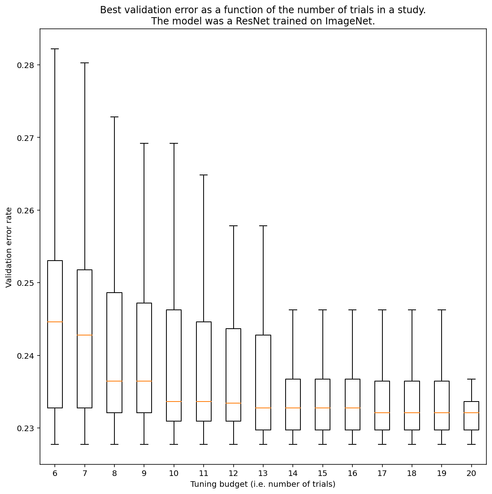
</p>

<p align="center"><b>Figure 3:</b> ResNet-50 在 ImageNet 上进行了 100 次试验调整。 通过自举，模拟了不同数量的调整预算。 上面绘制了每个试验预算的最佳性能的箱线图。

-   这个问题没有办法笼统地回答，但是我们可以看具体的例子。
-   正如Figure 3所示那样, 研究中的试验次数会对结果产生重大影响。
    -   请注意，当对6个试验进行抽样时，与对20个试验进行抽样时的四分位间距有多大的区别。
    -   即使进行了20次试验，运气特别好和运气特别差的研究之间的差异也可能大于使用固定超参数在不同随机种子上重新训练该模型之间的典型差异，对于此工作量可能约为 +/- 0.1% 的验证误差的概率约为 23%。

</details>

### 如何调试和缓解优化失败

<details><summary><em>[点击展开]</em></summary>
<br>
***总结***： *如果在优化模型时遇到困难，那么在尝试其他东西之前解决这些问题很重要。 诊断和纠正训练失败是一个活跃的研究领域。*

<p align="center">
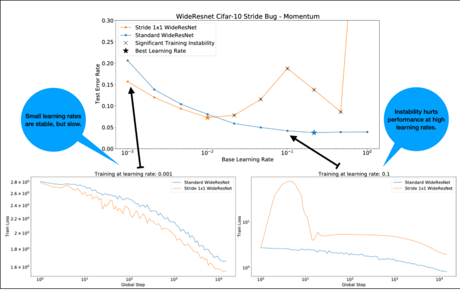
</p>


<p align="center"><b>Figure 4:</b> 在 WideResnet 中更改单个残差块 (2x2 -> 1x1) 中的步幅会导致训练不稳定。 这不会降低在低学习率下的性能，但由于不稳定的影响，高学习率不再能很好地进行训练。 使用1000步的学习率预热可以解决这种特殊的不稳定情况，允许以 0.1 的最大学习率进行稳定训练。</p>

#### 识别不稳定的训练任务

-   当学习率过大时，任何训练任务都会变得不稳定，但当不稳定迫使我们使用太小的学习率时，这才会是问题
-   这里至少有两种类型的不稳定的训练任务值得需要进行区分：
    1.  初始化/训练早期中存在的不稳定。
    2.  训练中期突然出现的不稳定。
-   我们可以采用系统的方法来找出训练任务中存在的稳定性问题.
    1.  进行一次学习率扫描(不考虑学习率衰减的固定学习率)，并找到最佳的学习率 lr*.
    2.  绘制学习率略高于 lr* 的训练损失曲线。
    3.  如果学习率大于 lr* 的训练损失曲线显示不稳定（误差在训练期间上升而不下降），那么修复不稳定性可能会得到更好的训练结果(说明我们最佳的学习率比较临界)。
-   在训练过程中记录全损失梯度的 L2 范数的变化(全损失梯度的 L2 范数是指在深度学习中，对于每个参数的梯度进行平方并相加后再取平方根的过程，反映了损失函数在当前状态下沿着梯度方向的变化程度。当前状态下的梯度向量越大，说明当前状态下的模型参数需要更大的更新量才能更好的逼近最优解)，如果我们发现全损失梯度的 L2 范数异常值非常大，这可能表明模型参数在某一时刻发生了非常大的变化，导致训练过程中出现不稳定性（例如误差上升而不下降）。 这可以告诉我们该如何选择梯度/更新剪辑。

**注意：** 某些模型会在非常早期的阶段显示出不稳定的情况，随后出现恢复，这会导致出现缓慢但稳定的训练(这可能会成为问题)。 **常见的评估方法可能会因为评估不够频繁而错过这些问题！**

为了检查出这一问题，我们可以使用 `lr = 2 * current best` 来进行一次仅包含500次训练的计划，但每执行一次训练都要进行一次评估。

<p align="center">
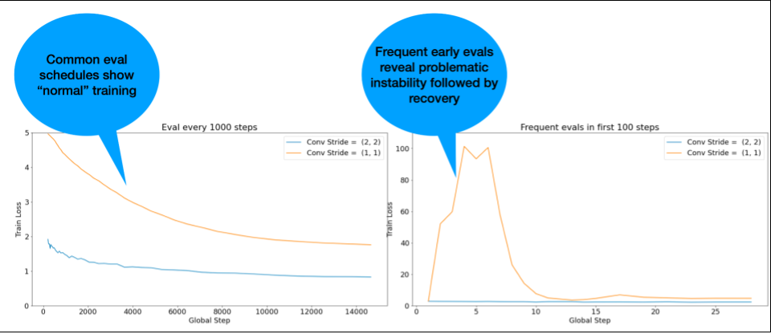
</p>

<p align="center"><b>Figure 5:</b> 该图展示的是训练开始时频繁更新评估的结果。如果怀疑模型受到早期训练不稳定的影响，则很有用。</p>

#### 常见不稳定模式的潜在修复方式

-   使用学习率预热
    -   最适合用于早期训练不稳定的情况。
-   使用梯度截断
    -   对于早期和中期训练中不稳定情况都有好处，可能会解决一些学习率预热无法解决的问题。
-   尝试使用新的优化器
    -   Adam 有时可以处理一些 Momentum 无法处理的不稳定影响。这也是该领域的一个活跃研究领域。
-   确保使用最佳实践/初始化：
    -   例如，如果模型中尚未包含残差连接和归一化，则添加它们。
-   归一化应该是残差之前的最后一个操作。例如， x +Norm(f(x))。
-   众所周知，Norm(x + f(x)) 会引起问题。(译注：Norm相当于白化，意在降低层参数的训练敏感性，而残差大大增加了训练参的敏感性，所有在残差前的f(x)归一化有助于降低不稳定性)
-   尝试将残差调控因子初始化为 0 （例如，[ReZero init所示](https://arxiv.org/abs/2003.04887)）$\boldsymbol{x}_{i+1}=\boldsymbol{x}_i+\alpha_i F\left(\boldsymbol{x}_i\right)$.
-   降低学习率
    -   这是最终手段。

#### 学习率预热

<p align="center">
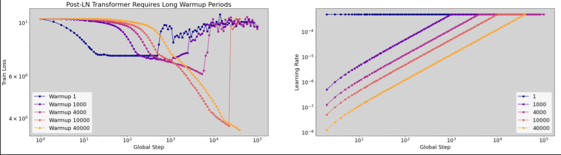
</p>
<p align="center"><b>Figure 6:</b> 预热期间不稳定的示例（注意横轴的刻度是以对数的形式展示）。 在这种情况下，成功训练需要4万次的预热。</p>


##### 何时对学习率进行预热

<p align="center">
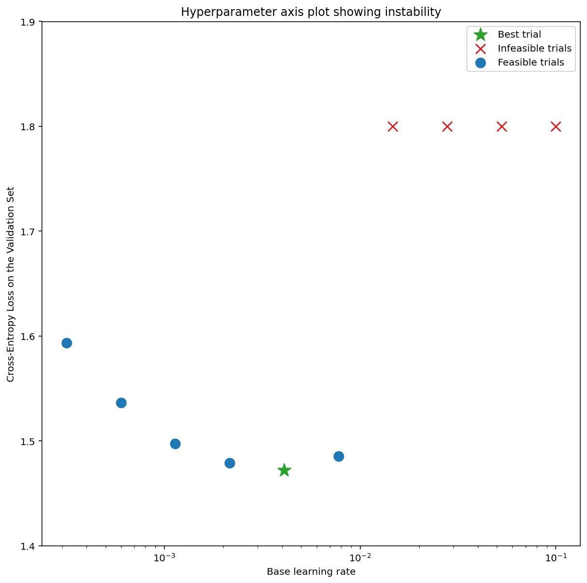
</p>

<p align="center"><b>Figure 7a:</b> 表现出训练不稳定性的模型的超参数轴图示例。 最佳学习率处于可行的边缘。 “不可行”试验被定义为产生 NaN 或异常高的损失值的试验。</p>

<p align="center">
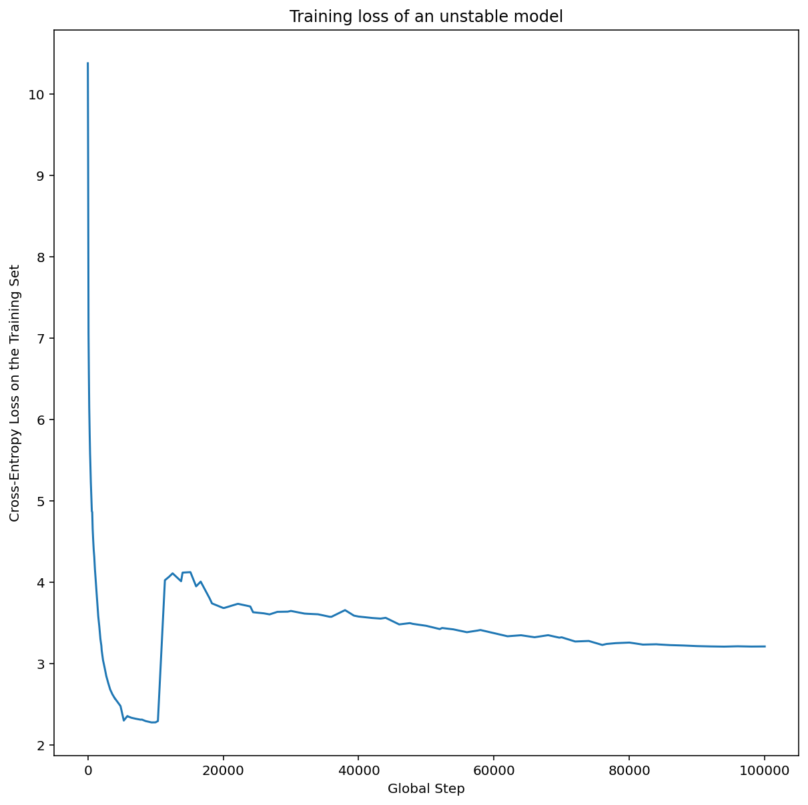
</p>

<p align="center"><b>Figure 7b:</b> 模型训练损失中不稳定的学习率</p>

-   Figure 7a 展示的是一个超参数轴图，该图表明模型正在经历训练不稳定，因为最佳学习率恰好位于可行的边缘。
-   Figure 7b展示了以5-10倍的峰值学习率来训练模型中产生的训练损失是如何通过双重检查的。如果该图展示的训练损失在稳步下降后突然上升（例如，如图中10000步处展示的那样），那么该模型可能存在着优化不稳定性的情况。
##### 如何对学习率进行预热

<p align="center">
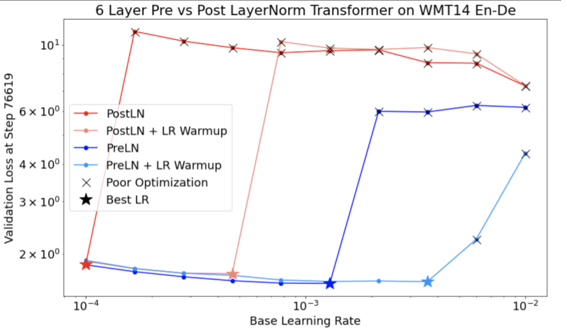
</p>

<p align="center"><b>Figure 8:</b> 学习率预热对解决训练不稳定性的有益影响</p>

-   在上面的内容中，我们假设从业者已经确定了让模型变得不稳定的学习率。也就是 `unstable_base_learning_rate`。
-   预热的过程涉及了预先安排一个学习率计划，这个计划会将学习率从0提升到某个稳定的 `base_learning_rate`，这至少比 `unstable_base_learning_rate`要大一个数量级。
    默认设置是尝试使用 `unstable_base_learning_rate` 10倍大小的 `base_learning_rate`。值得注意的是，对于使用例如100倍
    `unstable_base_learning_rate`这样的数值，那么可能需要重新运行整个过程。具体安排如下：
    -   在`warmup_steps`的过程中，将数值从0提升到 `base_learning_rate`。
    -   `post_warmup_steps`的过程中，以一个恒定的速率进行训练。
-   我们的目标是找到最少的 `warmup_steps`，以此来让我们获得远高于`unstable_base_learning_rate`的峰值学习率。
-   因此，对于，每个 `base_learning_rate`来说， 我们需要对 `warmup_steps` 以及`post_warmup_steps`进行调优。 通常将 `post_warmup_steps` 设定为`warmup_steps`的两倍就可以了。
-   预热可以独立于现有的衰减计划进行调整。
    `warmup_steps` 应该以几个不同的数量级进行扫描。例如，在样本学习中可以以[10, 10<sup>3</sup>, 10<sup>4</sup>,10<sup>5</sup>]这样的数量级进行尝试。最大的搜索值不应超过`max_train_steps`的10%。
-   一旦建立了不会破坏以 `base_learning_rate` 进行训练的`warmup_steps`，就应该将其应用于Baseline模型。
    本质上，我们将这个安排添加到现有安排上，并使用上面讨论中选择的最佳检查点来将这个实验与Baseline进行比较。例如，如果我们一开始的`max_train_steps`的值是10000，
    并进行了1000次`warmup_steps`。那么，新的训练过程总共应当进行了11000次。
-   如果稳定训练需要较长的`warmup_steps`（大于`max_train_steps`的5%），则可能需要增加`max_train_steps`来解决这个问题。
-   在整个工作量的范围中并不存在真正意义上的`标准`值。有些模型可能只需要100次训练，然而有些模型则可能需要4万次以上的训练，尤其是Transformer类。

#### 梯度截断

<p align="center">
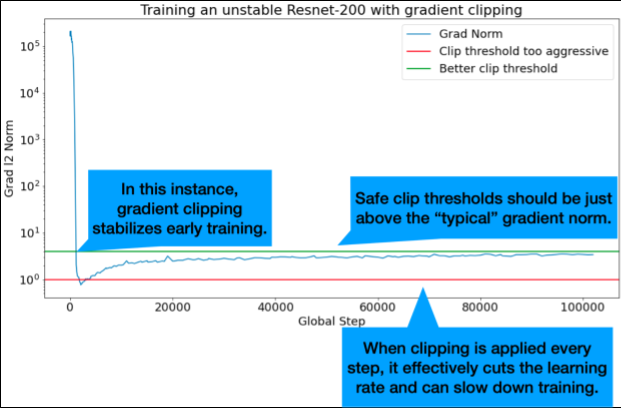
</p>

<p align="center"><b>Figure 9:</b> 梯度截断纠正早期训练不稳定性的图示。</p>

-   当出现较大或离群的梯度问题时，梯度截断会变得非常有用。
-   梯度截断可以修复早期训练中出现的不稳定性（早期较大的梯度范数），或中期训练中出现的不稳定性（训练中期突然出现的梯度尖峰）。
-   有时，较长的预热时间可以纠正梯度截断无法纠正的不稳定性: 请查看[之前的章节](#如何对学习率进行预热)。
    -   🤖 在预热的时候，进行梯度截断会发生什么？
-   理想的截断阈值要刚好高于“典型的”梯度范数。
-   下面是一个关于如何进行梯度截断的案例：
    -   如果梯度范数 $\left | g \right |$ 大于梯度截断的阈值 $\lambda$，那么就需要进行 ${g}'= \lambda \times \frac{g}{\left | g \right |}$。此处的 ${g}'$是新的梯度。
-   在训练期间记录下未截断梯度范数。 默认情况下会生成:
    -   梯度范数与步骤数量的关系图
    -   聚合所有步数的梯度范数直方图
-   根据梯度范数的第90百分位数选择梯度截断阈值。
    -   这个阈值的大小与工作量有关。但90%是一个很好的选择。但如果这个奏效，那么可以对其进行调优。
    -   🤖 那么，某种适应性策略会怎么样呢?
-   如果我们尝试梯度截断并且不稳定问题仍然存在，那么我们可以更努力地尝试（例如，阈值更小）。
-   极端激进的梯度截断本质上是一种降低学习率的奇怪方式。 如果我们发现自己使用了非常激进的截断，那么我们可能应该只降低学习率。
-   我们通常会认为以某种方式将超过 50% 的更新剪裁为“极其激进”。
-   如果我们需要进行极其激进的梯度截断来处理我们的不稳定问题，那么我们不妨降低学习率。

</details>

### 为什么将学习率和其他优化参数称为超参数？ 它们不是任何先验分布的参数。

<details><summary><em>[点击展开]</em></summary>
<br>

-   确实，在贝叶斯机器学习中，“超参数”这一术语拥有一种更加精确的[含义](https://en.wikipedia.org/wiki/Hyperparameter)，我们在深度学习中调优的学习率和大部分其他被叫做“超参数”的参数都是对术语的一种滥用。
-   我们更愿意使用“元参数”这个术语来表示学习率、架构参数以及我们在深度学习中调整的所有其他参数， 因为它避免了因滥用“超参数”一词而引起的潜在混淆（例如，可能在讨论贝叶斯优化时，概率响应曲面模型拥有它自己的真实超参数，此时使用超参数一词是不合适的。）
-   不幸的是，尽管可能会造成混淆，但超参数这个术语在深度学习社区中已经变得极为通俗。
-   因此，对于一份文档而言，例如本文。为了面向普通大众，我们决定为该领域的一个混乱来源做出贡献，希望避免产生另一个混淆。
-   也就是说，在发布一篇研究论文的时候，我们可能采取了一种不同的说法。并且，在大多数情况下，我们推荐其他人使用“元参数”这个说法。

</details>

### 为什么不应该调整Batch Size来直接提高验证集性能?

<details><summary><em>[点击展开]</em></summary>
<br>

-   *在不更改训练工作流其他细节的情况下*， 修改batch size 通常会影响验证集的性能。
-   但是，如果针对每个batch size单独调优，则两个batch size之间的验证集性能差异通常会消失。
-   受batch size影响最强烈的那些超参数，即优化器超参数（例如：学习率、动量）和正则化超参数，这些东西对于每个batch size进行单独调优的时候是最重要的。
    - 由于样本方差的原因，较小的batch size会在训练算法中引入更多的不确定性，并且这些不确定性可能存在着正则化效果。因此，较大的batch size可能更容易过度拟合。并且，这可能需要更强的正则化和/或额外的正则化技术。
- 此外， 当修改batch size的大小时，[训练步骤的数量可能也需要进行调整](#choosing-the-batch-size-to-minimize-training-time)。
-   一旦考虑了所有这些因素带来的影响，目前还没有任何能够令人信服的证据表明batch size会影响最大可实现的验证性能（具体请阅读 [Shallue et al. 2018](https://arxiv.org/abs/1811.03600)）。
</details>

### 所有流行的优化算法的更新规则是什么？

<details><summary><em>[点击展开]</em></summary>

<br>

#### Stochastic gradient descent (SGD)

$$\theta_{t+1} = \theta_{t} - \eta_t \nabla \mathcal{l}(\theta_t)$$

#### Momentum

$$v_0 = 0$$

$$v_{t+1} = \gamma v_{t} + \nabla \mathcal{l}(\theta_t)$$

$$\theta_{t+1} = \theta_{t} - \eta_t v_{t+1}$$

#### Nesterov

$$v_0 = 0$$

$$v_{t+1} = \gamma v_{t} + \nabla \mathcal{l}(\theta_t)$$

$$\theta_{t+1} = \theta_{t} - \eta_t( \gamma v_{t+1} + \nabla \mathcal{l}(\theta_{t})$$

#### RMSProp

$$v_0 = 1 \text{,} m_0 = 0$$

$$v_{t+1} = \rho v_{t} + (1 - \rho) \nabla \mathcal{l}(\theta_t)^2$$

$$m_{t+1} = \gamma m_{t} + \frac{\eta_t}{\sqrt{v_{t+1} + \epsilon}}\nabla \mathcal{l}(\theta_t)$$

$$\theta_{t+1} = \theta_{t} - m_{t+1}$$

#### ADAM

$$m_0 = 0 \text{,} v_0 = 0$$

$$m_{t+1} = \beta_1 m_{t} + (1 - \beta_1) \nabla \mathcal{l} (\theta_t)$$

$$v_{t+1} = \beta_2 v_{t} + (1 - \beta_2) \nabla \mathcal{l}(\theta_t)^2$$

$$b_{t+1} = \frac{\sqrt{1 - \beta_2^{t+1}}}{1 - \beta_1^{t+1}}$$

$$\theta_{t+1} = \theta_{t} - \alpha_t \frac{m_{t+1}}{\sqrt{v_{t+1}} + \epsilon} b_{t+1}$$

#### NADAM

$$m_0 = 0 \text{,} v_0 = 0$$

$$m_{t+1} = \beta_1 m_{t} + (1 - \beta_1) \nabla \mathcal{l} (\theta_t)$$

$$v_{t+1} = \beta_2 v_{t} + (1 - \beta_2) \nabla \mathcal{l} (\theta_t)^2$$

$$b_{t+1} = \frac{\sqrt{1 - \beta_2^{t+1}}}{1 - \beta_1^{t+1}}$$

$$\theta_{t+1} = \theta_{t} - \alpha_t \frac{\beta_1 m_{t+1} + (1 - \beta_1) \nabla \mathcal{l} (\theta_t)}{\sqrt{v_{t+1}} + \epsilon} b_{t+1}$$

</details>

## 致谢

-   我们要感谢Max Bileschi, Roy Frostig, Zelda Mariet, Stan
    Bileschi, Mohammad Norouzi, Chris DuBois以及Charles Sutton 阅读本手稿并提出宝贵的意见来改进我们的内容。
-   我们复用了最初由Naman Agarwal为其他联合研究制作的几个分析图的一些实验数据。
-   我们要感谢Will Chen对文档演讲内容提出的宝贵建议。
-   我们还要感谢 Rohan Anil 与我们进行了有益的讨论。

## 引用

```
@misc{tuningplaybookgithub,
  author = {Varun Godbole and George E. Dahl and Justin Gilmer and Christopher J. Shallue and Zachary Nado},
  title = {Deep Learning Tuning Playbook},
  url = {http://github.com/google/tuning_playbook},
  year = {2023},
  note = {Version 1.0}
}
```

## 关于贡献

-   这并不是一款由谷歌官方所支持的产品。

-   我们欢迎听到来自您的反馈。

    -   如果你喜欢这本手册, 请给我们 [留一颗小星星](https://docs.github.com/en/get-started/exploring-projects-on-github/saving-repositories-with-stars#starring-a-repository)！或者，可以给我们的邮箱
        deep-learning-tuning-playbook \[at\] googlegroups.com发送邮件。 这些推荐有帮于证明我们创建更多这样的内容是合理的。
    -   如果有任何不正确的地方，欢迎在GitHub的讨论区提出相关问题。对于不适合问题的问题或其他消息，请在 GitHub 上打开一个新的讨论主题。

-   正如在序言中所讨论的，这是一份在线文档。我们会定期进行大大小小的修改。如果你想获取相关通知，请关注我们的仓库 (具体配置请查看 [操作指南](https://docs.github.com/en/account-and-profile/managing-subscriptions-and-notifications-on-github/setting-up-notifications/configuring-notifications#configuring-your-watch-settings-for-an-individual-repository)).

-   请不要在未通过问题跟踪系统与作者协调的情况下提交pull request。

### 贡献者许可协议

对该项目的贡献必须附有贡献者许可协议 (CLA)。 对于你（或你的雇主）所贡献的内容将保留其相关版权； 这只是允许我们使用和重新分配您的贡献作为项目的一部分。 请前往 <https://cla.developers.google.com/> 查看您当前存档的协议或签署新协议。

通常，您只需要签署一次CLA协议即可。因此，如果您已经签署过一次（即使针对的是其他项目），那么您可能无需再次签署。

### 代码审核

所有的提交（包括来自项目成员的提交）都需要进行审核。出于这个目的，我们会使用Github提供的pull request功能来进行代码审核。 关于如何使用pull request，请查看
[GitHub Help](https://help.github.com/articles/about-pull-requests/) 获取更多信息.

### 社区指南

本项目遵循
[谷歌开源社区指南](https://opensource.google/conduct/).

